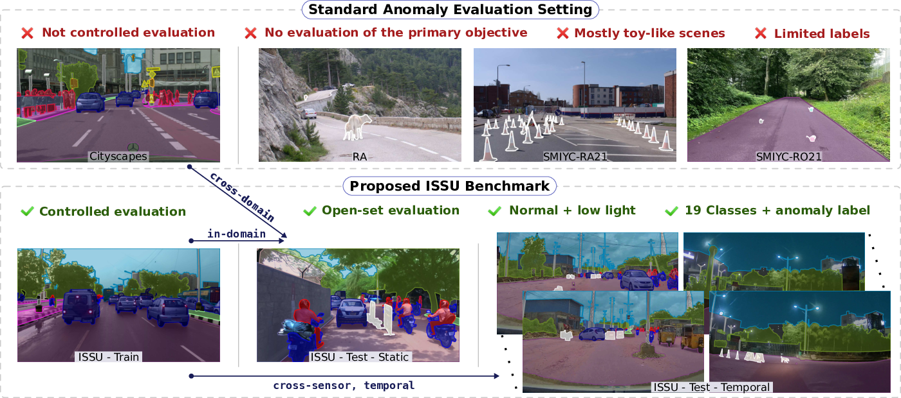

# A Dataset for Semantic Segmentation in the Presence of Unknowns
Official benchmarking code for evaluation on dataset published in "A Dataset for Semantic Segmentation in the Presence of Unknowns" CVPR 2025 paper



## Update
- **26. February 2025** - Accepted to CVPR 2025

## Installation
Clone the repository
```bash
git clone https://github.com/vojirt/benchmark_issu.git issu_benchmark 
```

Set up the python environment using conda
```bash
cd issu_benchmark
conda create --name issu_bench python=3.10
conda activate issu_bench
pip install -r requirements.txt
```
or python virtual environment
```bash
cd issu_benchmark
python3 -m venv .venv
source .venv/bin/activate
python3 -m pip install -r requirements.txt
```

## Dataset
- The ISSU dataset contains 2118 test images of driving scenes containing objects from 19 CityScape classes and anomalies.
- The dataset is divided into three splits - ISSU-Train, ISSU-Test-Static, and ISSU-Test-Temporal. An additional ISSU-Test-Temporal-Clip shares the same ground-truth as ISSU-Test-Temporal but contains clips to allow temporal inference.
- Instructions for downloading and composing different ISSU datasets is provided [here](https://github.com/vojirt/benchmark_issu/blob/main/benchmark/datasets/scripts/DOWNLOAD.md)

## Evaluation setups
- Cross-domain: Segmentation models are trained on CityScapes train set and evaluated on ISSU-Test sets.
- In-domain   : Segmentation models trained on ISSU-train set and evaluated on ISSU-Test sets.
  
## Evaluation Protocols
- Road **obstacle**: Anomaly Segmentation Evaluation. Region of Interest is road and anomalies. Metrics are average precision (AP), FPR (@ 95% TPR), TPR (@ 5% FPR), F1, PPV, sIoU.
- Road **anomaly** : Anomaly Segmentation Evaluation. Region of Interest is the 19 CityScape classes and anomalies. Metrics are average precision (AP), FPR (@ 95% TPR), TPR (@ 5% FPR), F1, PPV, sIoU.
- Closed-set       : Semantic Segmentation Evaluation. Region of Interest is 19 CityScape classes. Metrics are Intersection over Union (IoU).
- Open-set         : Semantic & Anomaly Segmentation Evaluation. Region of Interest is 19 CityScape classes and anomalies. Metrics are open Intersection over Union (oIoU) at 95% TPR and at 5% FPR.


## Benchmarking
Instructions for storing predictions for ISSU-Test sets are provided [here](https://github.com/vojirt/benchmark_issu/blob/main/benchmark/predictions/PREDICTIONS.md). The evaluation script `example_inference_with_metrics` performs the benchmarking for different methods `(e.g. EAM, YOUR_METHOD)` whose predictions are stored in `benchmark/predictions/{EAM/YOUR_METHOD}`. Protocols can be selected with `--protocol` argument. By default, closed-set and open-set protocols are evaluated when `anomaly` protocol is selected. Also, by default, benchmarked outputs are saved in `outputs`. Finally, `print_results` prints the final metrics similar to presented in the paper in `outputs/results.md`.
```bash
cd benchmark
python example_inference_with_metrics.py --method EAM,YOUR_METHOD --result_path ./predictions --protocol {obstacle,anomaly,all}
python print_results.py --method EAM,YOUR_METHOD --protocol {obstacle,anomaly,all} 
```
To obtain results for different lighting variations and anomaly sizes, add `--lighting_var` and `--anom_size_var` arguments to the above commands.

## Citation
If you use this repository, please consider citing our accompanying CVPR 2025 publication [paper]():
```latex
	@inproceedings{laskar2025datasetsemanticsegmentationpresence,
		title={{A Dataset for Semantic Segmentation in the Presence of Unknowns}},
		author={Zakaria Laskar and Tomáš Vojíř and Matej Grcic and Iaroslav Melekhov and Shankar Gangisetty and Juho~Kannala and Jiri Matas and Giorgos Tolias and C.V. Jawahar},
		booktitle={CVPR},
		year={2025},
	}
```

and [SMIYC paper](https://arxiv.org/abs/2104.14812):
```latex
	@inproceedings{chan2021segmentmeifyoucan,
		title={SegmentMeIfYouCan: A Benchmark for Anomaly Segmentation},
		author={Robin Chan and Krzysztof Lis and Svenja Uhlemeyer and Hermann Blum and Sina Honari and Roland Siegwart and Pascal Fua and Mathieu Salzmann and Matthias Rottmann},
		booktitle={Thirty-fifth Conference on Neural Information Processing Systems Datasets and Benchmarks Track},
		year={2021},
	}
```

and [IDD]()
```latex
	@inproceedings{varma2019idd,
		title={{IDD: A dataset for exploring problems of autonomous navigation in unconstrained environments.}},
		author={Girish Varma and Anbumani Subramanian and Anoop M. Namboodiri and Manmohan Chandraker and C. V. Jawahar},
		booktitle={WACV},
		year={2019},
	}
	@inproceedings{shaik2024idd,
		title={{IDD-AW: A benchmark for safe and robust segmentation of drive scenes in unstructured traffic and adverse weather.}},
		author={Furqan Ahmed Shaik and Abhishek Reddy Malreddy and Nikhil Reddy Billa and Kunal Chaudhary and Sunny Manchanda, and Girish Varma.},
		booktitle={WACV},
		year={2024},
	}
	@inproceedings{parikh2024idd,
		title={{IDD-X: A multi-view dataset for ego-relative important object localization and explanation in dense and unstructured traffic.}},
		author={Chirag Parikh and Rohit Saluja and C. V. Jawahar and Ravi Kiran Sarvadevabhatla.},
		booktitle={ICRA},
		year={2024},
	}
	
```

## Acknowledgement 
We thank the authors of the
[SMIYC](https://github.com/SegmentMeIfYouCan/road-anomaly-benchmark) benchmark,
which served as base for this repository and many files are direct copies
or only slightly modified.
